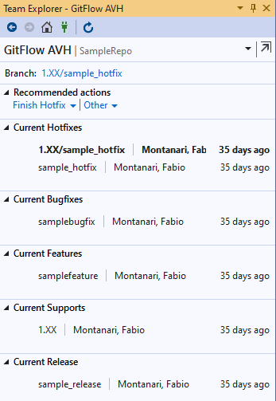

# GitFlow AVH for Visual Studio

Built on top of an extension originally created by Jakob Ehn

### Features 
This Team Explorer extension integrates GitFlow AVH into your development workflow. It lets you easily create and finish feature, bugfix, release, hotfix and support branches right from Team Explorer. 

It exposes the most common GitFlow options when finishing branches, such as options to delete branches, rebase on development branch and tagging of release branches.
 

### Prerequirements
The extension requires Visual Studio 2019. It will install GitFlow for you if it is not found on the machine. Since GitFlow depends on Git for Windows, this must be installed before using the extension 
 

## Screenshots

### Initialize repo for GitFlow

### Team Explorer menu item

### Start New Feature

### Finish Feature

### Start New Bugfix

### Start New Release

### Start New Hotfix

### Start New Support

### List of current GitFlow branches

